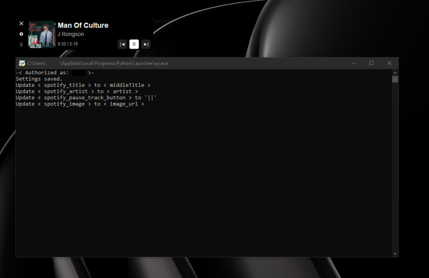

# Python Spotify Overlay

A lightweight, customizable Spotify overlay that displays the current track, artist, album artwork and playback controls on top of your screen.


## Features
- Real-time track info (title, artist, duration, cover)
- Play/Pause, Previous, Next buttons
- Adjustable opacity, fade effects
- Always-on-top, draggable, click-through mode
- Settings window & system tray menu
- Spotify login via browser


## Requirements
- Python 3.8+
- Libraries: `spotipy`, `customtkinter`, `pystray`, `pillow`, `requests`, `keyboard`

```bash
pip install spotipy customtkinter pystray pillow requests keyboard
```


## Installation
1. Clone or download the project
2. Install dependencies (see above)
3. Make sure the project structure looks like this:
```text
python-spotify-overlay/
├─ assets/
│  ├─ album-cover.png
│  ├─ app-icon.ico
│  ├─ app-icon.png
│  ├─ close-icon.png
│  ├─ drag-icon.png
│  └─ settings-icon.png
├─ auth_success.html
├─ main.py
├─ overlay.py
├─ settings.py
├─ spotify.py
└─ utils.py
```


## Quick Start

```bash
python main.py
```

What happens on first launch:
1. The browser will open for Spotify authorization
2. The overlay appears → you can drag it, open settings, or use the tray icon
3. Tray menu: Hide/Show, Settings, Close

That’s it. After the first authorization, the app will reuse the cached token and won’t ask you again unless it expires.


## Settings
- Opacity (normal & hover)
- Fade delay & duration
- Always on top / Draggable / Click-through
- Changes are saved automatically


## Configuration Files
- settings.json: Stores user preferences (opacity, positions, etc.). Located in app data folder (e.g., %APPDATA%\rwp-PythonSpotifyOverlay on Windows).
- .cache: Spotify token cache (in the same folder).

Delete these files to reset to defaults.


## Spotify API Setup (for forks & custom builds)

This project includes the author's Spotify **Client ID** by default, so you can run the overlay out of the box.
If you plan to use this repository as a base for your own project or distribute modified builds, you should register your own Spotify application and provide your own credentials.

### Quick start (use as-is)

1. Clone the repository.
2. Run the app.

```bash
python main.py
```

3. On the first launch, your browser will open to authorize access to Spotify.

No additional setup is required if you only want to try the overlay.

### Custom setup (recommended for developers)

If you are building your own version of this project, follow these steps:

1. Go to https://developer.spotify.com/dashboard.
2. Log in and click Create an app.
3. Open your app settings:
    - Copy your Client ID
    - Add a Redirect URI (for example): `http://127.0.0.1:8888/callback`
4. Open `spotify.py` and replace the values:

```python
CLIENT_ID = "YOUR_CLIENT_ID_HERE"
REDIRECT_URI = "http://127.0.0.1:8888/callback"  # change this if you use a different URI
SCOPE = "user-read-private user-read-playback-state" # keep this unchanged
```

5. Save the file and run the application again.

On the first launch, you will be redirected to the browser to authorize your Spotify account.
The access token will be cached locally, so you won’t need to repeat this step every time.

### Notes
- Do not use the author's Client ID for production builds or redistributed versions of this application.
- Each developer should use their own Spotify application credentials to avoid API limits and unexpected issues.
- Never commit any client secrets or private tokens to a public repository.


## Troubleshooting
- No Song Info: Ensure Spotify is playing and you're online. Check console for API errors.
- Window Not Transparent/Draggable: Windows-specific (uses ctypes). On other OS, may need adjustments.
- Auth Fails: Check CLIENT_ID in spotify.py. Clear .cache file if issues.
- Freezing on drag: Fixed in recent versions using threaded updates (start_update_loop).
- Errors: Run in terminal for logs. Common: Missing libraries - reinstall deps.

If issues persist, check console output or open an issue on GitHub.

## Preview

