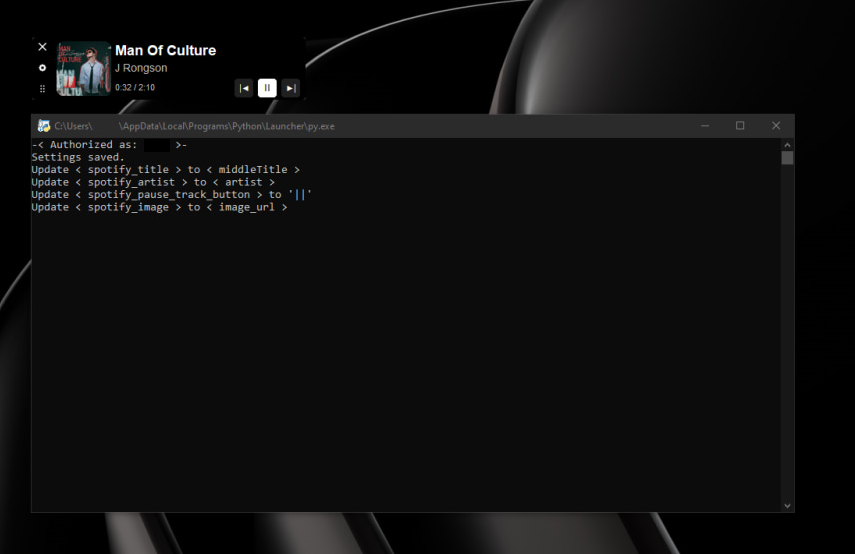

# [OUTDATED] :(
# Python Spotify Overlay *(not working due to new spotify restrictions)*

Lightweight desktop overlay for Spotify built with Python and CustomTkinter.
Displays current track title, artist, album cover, and basic controls in a minimal floating window.

## ⚠️ Very Important Notice

Due to [recent Spotify API](https://developer.spotify.com/documentation/web-api/tutorials/february-2026-migration-guide) changes, this application requires the app owner to have a Spotify Premium subscription.

The app won't work without the premium version, and I can't afford the premium version.
So the project has probably failed, but I'll try to create a new app based on this one without Spotify, but using Windows GlobalSystemMediaTransportControlsSessionManager instead, i guess.

---

## Overview

This project creates a small, always-on-top overlay that shows what you're currently listening to on Spotify.

Designed to be:

- simple
- visually clean
- low overhead

Unlike full clients, this is just an overlay, not a replacement for Spotify.


## Features

- Track title and artist display
- Album cover preview
- Play / Pause button
- Window dragging
- Adjustable transparency
- Fade-in / fade-out animations
- Settings saved in JSON

---

## Screenshots



---

## Installation
1. Clone or download the project
2. Install dependencies (see below)

For example:
```bash
git clone https://github.com/rabwplen/python-spotify-overlay
cd python-spotify-overlay
pip install -r requirements.txt
```


## Requirements

- Python 3.10 or newer
- Spotify account

Dependencies are listed in `requirements.txt`.

---

## Running the app

```bash
python main.py
```

On first run, your browser will open for Spotify authentication.
After login, the overlay will start automatically.

---

## Project structure

```
.
├── assets/             # icons and images used by the overlay
├── main.py             # Entry point
├── overlay.py          # GUI logic (window, animations, controls)
├── spotify.py          # Spotify authentication and API interaction
├── settings.py         # Default settings
├── utils.py            # File paths, config handling
├── test_basic.py       # Basic tests
├── requirements.txt
```

---

## Settings

Settings are stored automatically in a JSON file.

Depending on your OS:

- Windows → `%APPDATA%`
- Linux → `~/.config`

Example settings:

```json
{
    "default_opacity": 0.6,
    "hover_opacity": 0.8,
    "fade_delay": 1,
    "fade_duration": 0.2,
    "always_on_top": true,
    "can_drag": true,
    "click_through": false
}
```

---

## Limitations

- Performance issues may occur on some systems (especially due to frequent UI updates and animations)
- Limited control over Spotify (especially for free accounts)
- Requires internet connection
- GUI behavior may vary slightly across OS
- Sometimes it runs slowly because it's in Python

---

## Development

### Run tests

```bash
pytest
```

### Lint

```bash
flake8 .
```

---

## CI

GitHub Actions is used to:

- run tests
- check code style (flake8)

---

## Future improvements

- Improve animation performance and reduce CPU usage
- Optimize UI updates (avoid unnecessary redraws)
- Cache album covers to reduce network load
- Windows-specific optimizations
- Add configurable update interval
- Move heavy operations to background threads
- Reduce polling frequency for Spotify API
- More playback controls
- Custom themes and UI customization
- Possible future rewrite using C# WinUI (separate project)

---

## Contributing

Pull requests are welcome.

If you plan major changes, open an issue first.

---

## License

MIT License
